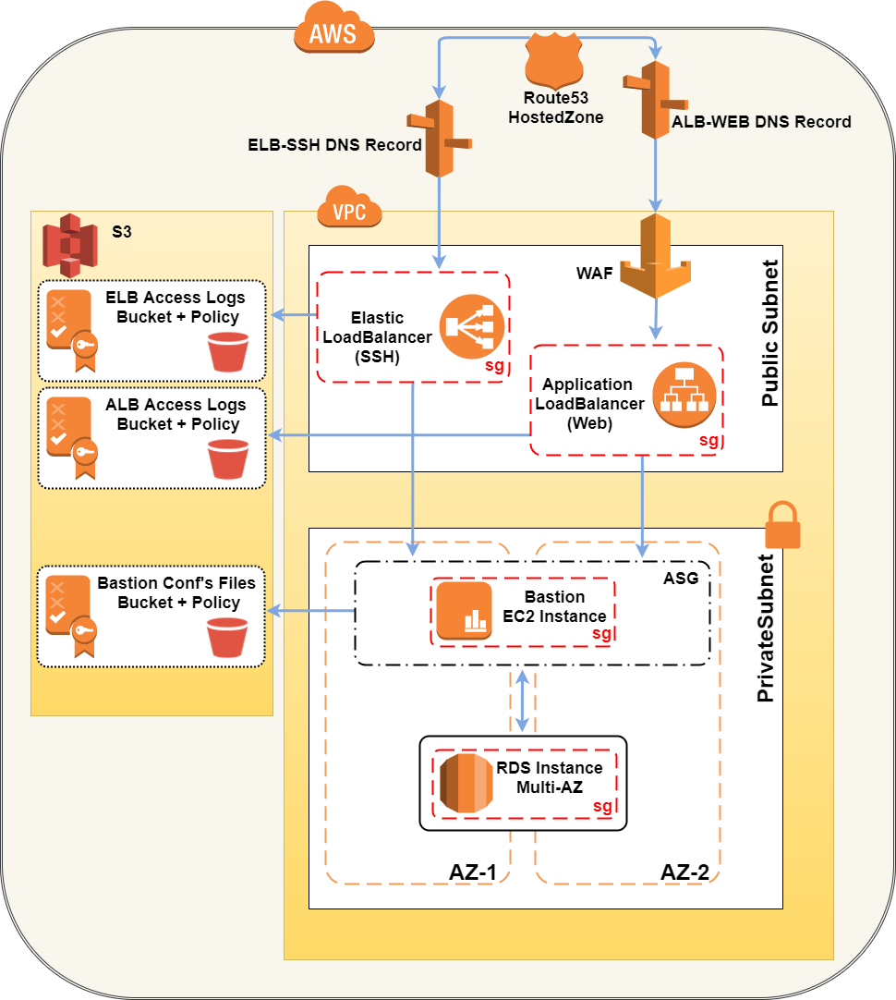

# Bastion Host: Apache Guacamole

This terraform module creates a Bastion Host infrastructure to deploy in an AWS VPC. It's based on the open source [Apache Guacamole](https://guacamole.apache.org/), a clientless remote desktop gateway based on HTML5 supporting SSH, RDP and VNC.

In order to get an in-depth understanding of the platform and its usage, it's highly recommended to read the [Guacamole Official Manual](https://guacamole.apache.org/doc/gug/), especially the [Using Guacamole](https://guacamole.apache.org/doc/gug/using-guacamole.html) and [Administration](https://guacamole.apache.org/doc/gug/administration.html) sections.

## Infrastructure Overview

### Infrastructure's components:

1. **Route53 DNS Records:**
    - ALB-WEB (pointing to the Application Load Balancer, used for the https connection to the bastion host)
    - ELB-SSH (pointing to the Elastic Load Balancer, used for SSH connection to the bastion host)
2. **Load Balancers:**
    - ALB-WEB: Application LB for the guacamole web app (running on tomcat); the ALB is also required by the WAF
    - ELB-SSH: Elastic LB for handling ssh connections 
3. **WAF - Web Application Firewall:**
    - Based on [AWS WAF SecurityAutomations](https://aws.amazon.com/it/answers/security/aws-waf-security-automations/)
    - Deployed through a custom CloudFormation Template, which creates the required waf rules, the WebACL and associates it to the ALB
4. **S3 Buckets:**
    - ALB Access Logs: Used by the Application LB for storing the web application access logs; there is also a Lamba function used by WAF to check it for detecting any suspicious activity
    - ELB Access Logs: Used by the Elastic LB for storing SSH access logs.
    - Bastion Confs: Used to store the _guacamole.properties_ file containing the guacamole key settings (MySQL endpoint/account and DUO integration parameters, if enabled). This file is generated at runtime by the module, uploaded to the S3 bucket and then downloaded by the EC2 instance through the user-data script.
5. **EC2 Instance:**
    - The actual instance where Guacamole is running. You can [Create your AMI based on ubuntu from this custom script](info_examples/guacamole_0.9.14_fresh_install_ubuntu) or you can use IPS AMI (contact us at IPSSETSquad@cimpress.com)
6. **RDS DB:**
    - Guacamole uses a MySQL DB for storing key settings (connections, users, preferences etc). This module uses an encrypted RDS instance in Multi-AZ

## Using the Module
You can have a demostration of how to call and use this module by looking at the [Module Caller Example](info_examples/module_caller_example.tf).
Furthermore, specific tech details are placed as comments within the module's code for the sake of clarity.
**Important Notes**: 
- In order to use the WAF, make sure you deploy the bastion in a [WAF Supported Region](https://aws.amazon.com/en/waf/faq/)
- The VPC ID, AMI ID and Subnet IDs are strings, which can be specified in different ways (hardcoded, as output from other modules or via data sources -as it's explained in the [Module Caller Example](info_examples/module_caller_example.tf).
- _Very Important_: Once the bastion host is deployed, make sure you allow the security group "bastion_guac_instance_sg" inbound on ssh/rdp (22/3389) on your VPC instances, otherwise the bastion host won't be able to establish remote sessions.
- DUO Multi-factor Authentication:
    - If you want to enable DUO, set the variable "duo_enabled" to true, and un-comment the following duo-related vars both in the module caller and in the variables.
    - If DUO is enabled, the "admin_username" variable needs to be a valid/enrolled DUO account username, so to be recognized by Duo for sending the push to your device (if you're in Cimpress, it's just your username without @cimpress.com).
    - Look at the [DUO Manual](https://guacamole.apache.org/doc/gug/duo-auth.html) for specific details.

## Accessing the Bastion Host
Once the module has been correctly deployed, you'll be able to access the bastion host:
- Via web @ https://${var.name}.${var.route53_hostedzone}/guacamole (e.g. https://bastion-guac.myzone.io/guacamole). Give it a few mins for all the resources to spin up properly
- Via ssh @ ${var.name}-ssh.${var.route53_hostedzone} (e.g. bastion-guac-ssh.myzone.io ), selecting the right port you've specified in the 'ssh_port' variable.

